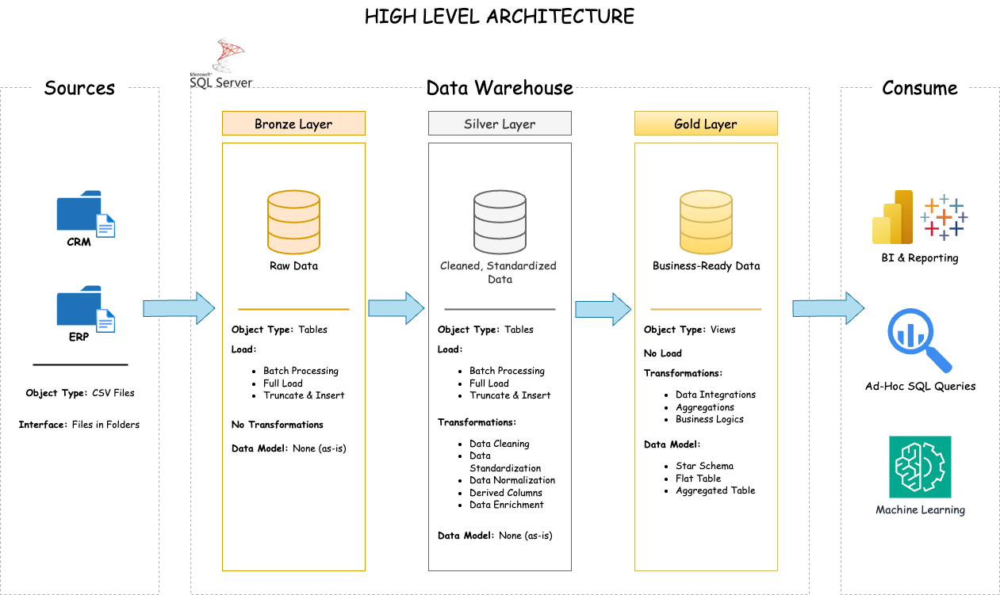

# 🏢 SQL Data Warehouse
This project demonstrates a comprehensive **SQL Data Warehousing and Analytics solution**, built from scratch using **Azure Data Studio** and **SQL Server Express**. It simulates an enterprise data pipeline by ingesting raw data from source systems, performing structured transformations, and delivering business-ready data for reporting and analytics using **Medallion Architecture**. It reflects industry best practices in **Data Engineering**, **ETL design**, and **SQL-based data modeling**.

---

## 🛠️ Tools & Technologies

This project utilizes the following tools and technologies for building, managing, and analyzing the SQL data warehouse:

| Tool / Technology        | Badge                                                                                     | Description |
|--------------------------|--------------------------------------------------------------------------------------------|-------------|
| **SQL Server Express**   |  | Relational database engine used to store and manage the data warehouse. |
| **Azure Data Studio**    |  | SQL editor used for database development and management. |
| **T-SQL (Transact-SQL)** |  | SQL dialect for defining transformations, querying, and manipulating data. |
| **Git & GitHub**         |  | Version control and project repository for managing code and documentation. |
| **Star Schema Design**   |  | Dimensional modeling technique used for analytical querying. |
| **Medallion Architecture** |  | Bronze, Silver, and Gold layers for raw, cleaned, and business-ready data. |
| **draw.io (diagrams.net)** |  | Used to design architectural diagrams and data flow visuals. |
| **Notion**               |  | Project planning and documentation hub for tracking milestones and tasks. |

> 🔍 *Optional tools like Power BI, Excel, or Tableau can be connected to the Gold Layer for business intelligence and reporting.*


---
## 🏗️ Data Architecture

The project follows a **Medallion Architecture** consisting of three key layers: **Bronze**, **Silver**, and **Gold** layers:


1. **✅ Bronze Layer**: Stores raw data as-is from the source systems. Data is ingested from CSV Files into SQL Server Database.
2. **✅ Silver Layer**: This layer includes data cleansing, standardization, and normalization processes to prepare data for analysis.
3. **✅ Gold Layer**: Houses business-ready data modeled into a star schema required for reporting and analytics.

---
## 📖 Project Overview

This project involves:

1. **Data Architecture**: Designing a Modern Data Warehouse Using Medallion Architecture **Bronze**, **Silver**, and **Gold** layers.
2. **ETL Pipelines**: Extracting, transforming, and loading data from source systems into the warehouse.
3. **Data Modeling**: Developing fact and dimension tables optimized for analytical queries.
<!-- 4. **Analytics & Reporting**: Creating SQL-based reports and dashboards for actionable insights. -->

---

## 🚀 Project Requirements

<!-- ### Building the Data Warehouse (Data Engineering) -->

#### Objective
Develop a modern data warehouse using SQL Server to consolidate sales data, enabling analytical reporting and informed decision-making.

#### Specifications
- **✅ Data Sources**: Import data from two source systems (ERP and CRM) provided as CSV files.
- **✅ Data Quality**: Cleanse and resolve data quality issues prior to analysis.
- **✅ Integration**: Combine both sources into a single, user-friendly data model designed for analytical queries.
- **✅ Scope**: Focus on the latest dataset only; historization of data is not required.
- **✅ Documentation**: Provide clear documentation of the data model to support both business stakeholders and analytics teams.
- **✅ Business Use Cases**:
  - Customer segmentation and behavior analysis
  - Product performance tracking
  - Sales trends

---

<!-- ### BI: Analytics & Reporting (Data Analysis)

#### Objective
Develop SQL-based analytics to deliver detailed insights into:
- **Customer Behavior**
- **Product Performance**
- **Sales Trends**

These insights empower stakeholders with key business metrics, enabling strategic decision-making.  

For more details, refer to [docs/requirements.md](docs/requirements.md). -->

## 📂 Repository Structure
```
SQL-Data-Warehouse/
│
├── datasets/                           # Raw datasets used for the project (ERP and CRM data)
│
├── docs/                               # Project documentation and architecture details
│   ├── data_architecture.png           # Image file for the project's architecture
│   ├── data_catalog.md                 # Catalog of datasets, including field descriptions and metadata
│   ├── data_flow.png                   # Image file for the data flow diagram
│   ├── data_integration.png            # Image file for the data integration diagram
│   ├── data_model.png                  # Image file for data model (star schema)
│   ├── naming-conventions.md           # Consistent naming guidelines for tables, columns, and files
│
├── scripts/                            # SQL scripts for ETL and transformations
│   ├── bronze/                         # Scripts for extracting and loading raw data
│   ├── silver/                         # Scripts for cleaning and transforming data
│   ├── gold/                           # Scripts for creating analytical models
│   ├── database_init.sql               # Script for creating database and schemas
│
├── tests/                              # Test scripts and quality files
│
├── README.md                           # Project overview and instructions
├── LICENSE                             # License information for the repository
└── .gitignore                          # Files and directories to be ignored by Git
```
---

## ⚙️ How to Run This Project

1. **Clone the Repository**

   ```bash
   git clone https://github.com/gloryodeyemi/SQL-Data-Warehouse.git
   cd SQL-Data-Warehouse
2. **Set Up SQL Server Environment**
* Install SQL Server Express and Azure Data Studio (if not already installed).
  
3. **Run ETL Scripts**
* Run `scripts/database_init.sql` to initialize the database and schemas.
* Load ERP and CRM CSV files into Bronze layer tables using scripts in `scripts/bronze/`.
* Transform and clean the data using scripts in `scripts/silver/`.
* Execute the script in `scripts/gold/` to generate business-ready data for analytics and reporting.

4. **Explore Data**
* Use the star schema in the Gold layer for analytical queries and reporting.

## 🧪 Testing & Validation
* Data quality checks scripts in the tests/ folder ensure:
  * Data consistency, accuracy, and standardization by checking for:
    - Null or duplicate primary keys.
    - Unwanted spaces in string fields.
    - Data standardization and consistency.
    - Invalid date ranges and orders.
    - Data consistency between related fields.
  * Uniqueness of surrogate keys in dimension tables.
  * Referential integrity between fact and dimension tables.
  * Validation of relationships in the data model for analytical purposes.
 
## 🔮 Future Work
This project lays the foundation for a robust and scalable data warehouse. Future enhancements could include:

* 📊 SQL-Based Analytics
  
  Develop advanced SQL queries to extract business insights such as:
  * Customer segmentation
  * Sales trends
  * Product performance
  * Revenue by country
    
* 📈 Integration with BI Tools
  
  Connect the Gold layer to Business Intelligence tools like:
  * Power BI
  * Tableau
  * Metabase
    
  ...to create interactive dashboards and self-service analytics for stakeholders.

* 🛠️ Automation & Scheduling

  Use SQL Server Agent or external orchestration tools (e.g., Airflow, Azure Data Factory) to automate ETL pipelines and data refreshes.

* 🔐 Role-Based Access Control (RBAC)

  Enforce security policies and access levels depending on user roles (data analyst, data engineer, etc.)

* 📦 Data Export APIs

  Build export mechanisms for downstream systems and data consumers.

## 🛡️ License

This project is licensed under the [MIT License](LICENSE). You are free to use, modify, and share this project with proper attribution.

## 🌟 About Me

Hi there! I'm **Glory Odeyemi**, a Data Engineer & Analyst!

Let's stay in touch! Feel free to connect with me on the following platforms:

[](https://www.linkedin.com/in/glory-odeyemi/)
[](https://github.com/gloryodeyemi)
[](https://gloryodeyemi.github.io/)
[](https://glowcodes.medium.com/)
